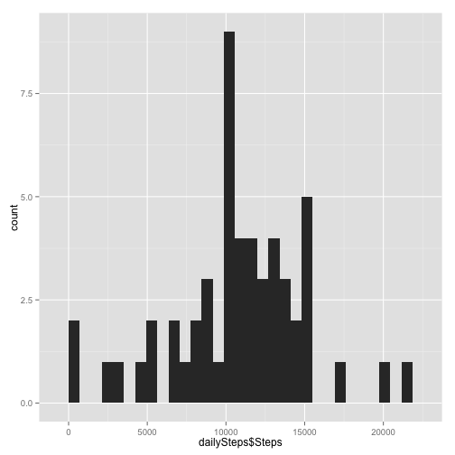
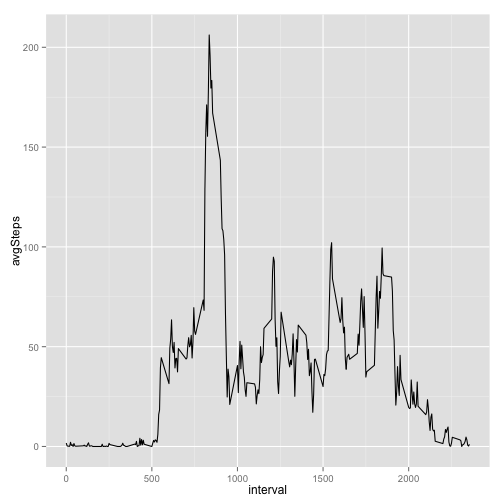
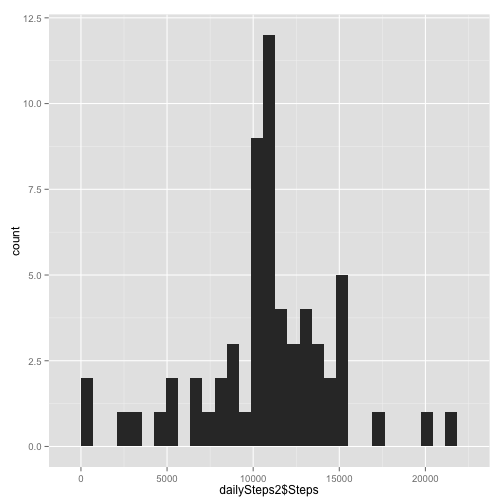
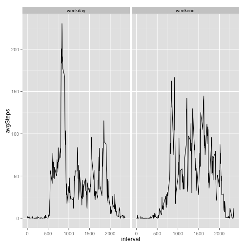

This is the week 2 peer assessment for the Reproducible Research course on Coursera.

The data set for this assignment consists of two months of data from an anonymous individual colected during the months of October and November, 2012, and include te number of steps taken in five-minute intervals each day.

The variables included in this dataset are:
- *steps*: Number of steps taking in a 5-minute interval (missing values are coded as NA)
- *date*: The date on which the measurement was taken in YYYY-MM-DD format
- *interval*: Identifier for the 5-minute interval in which measurement was taken

The dataset is stored in a comma-separated-value (CSV) file and there are a total of 17,568 observations in this dataset.

First we'll uinclude the ggplot 2 package for the upcoming visualizations:


```r
library("ggplot2", lib.loc="/Library/Frameworks/R.framework/Versions/3.1/Resources/library")
```

## Loading and preprocessing the data

First, we need to unzip the activity.zip file, and read in the data from the activity.csv file into a data fram


```r
unzip("activity.zip")

# read the data from the unzipped file into a data frame
stepData <- read.csv("activity.csv")
```


## What is mean total number of steps taken per day?

First we need to calculate the total number of steps per day:

```r
dailySteps <- aggregate(stepData$steps, by=list(Date=stepData$date), FUN=sum)
```

Now, rename the *steps* column of dailySteps

```r
names(dailySteps)[names(dailySteps)=="x"] <- "Steps"
```

Then, we'll generate a histogram of the total number of steps taken each day

```r
ggplot(dailySteps, aes(dailySteps$Steps)) + geom_histogram()
```

 

Now calculate mean number of steps per day:

```r
meanSteps <- mean(dailySteps$Steps, na.rm=TRUE)
```

And the median number of steps per day:

```r
medianSteps <- median(dailySteps$Steps, na.rm=TRUE)
```

The mean number of steps taken each day is: 1.0766189 &times; 10<sup>4</sup>  
The median number of steps taken each day is: 10765

## What is the average daily activity pattern?

The following computes the mean number of steps per 5-minute interval, across all 61 days:

```r
intervalAvg <- aggregate(stepData$steps, by=list(interval=stepData$interval), FUN = mean, na.rm = TRUE)

# rename calculated column of avg steps
names(intervalAvg)[names(intervalAvg)=="x"] <- "avgSteps"
```

Now that we have the average steps per interval, we can make a time series plot:

```r
ggplot(intervalAvg, aes(interval, avgSteps)) + geom_line(aes(group=1))
```

 

Now we calculate which interval, on average, has the highest number of steps:

```r
highIntervalRow <- intervalAvg[which.max(intervalAvg$avgSteps), ]
highInterval <- highIntervalRow$interval
```

The 5-minute interval which, on average across all the days in the dataset, contains the maximum number of steps is interval 835.

## Imputing missing values

First, let's calculate the number of observations with missing values:

```r
numMissingVals <- sum(is.na(stepData))
```

The number of missing values in the dataset is 2304.

Now we create a new dataset that is equal to the original dataset, but with missing data filled in by the interval average number of steps:

```r
stepData2 <- stepData
for (i in 1:nrow(stepData2)){
        # print(stepData[i, 1])
        if (is.na(stepData2[i,1])){
                stepData2[i,1] <- intervalAvg[intervalAvg$interval == stepData2[i,3],2]
        }
}
```

Now, with the new dataset with missing values imputed, we'll calculate and make a histogram of the total number of steps taken each day. Then we'll calculate and report the mean and median total number of steps taken per day.


```r
dailySteps2 <- aggregate(stepData2$steps, by=list(Date=stepData2$date), FUN=sum)

names(dailySteps2)[names(dailySteps2)=="x"] <- "Steps"

ggplot(dailySteps2, aes(dailySteps2$Steps)) + geom_histogram()
```

 

```r
meanSteps2 <- mean(dailySteps2$Steps, na.rm=TRUE)

medianSteps2 <- median(dailySteps2$Steps, na.rm=TRUE)
```

The mean number of steps taken each day is: 1.0766189 &times; 10<sup>4</sup>  
The median number of steps taken each day is: 1.0766189 &times; 10<sup>4</sup>

These values do not differ significanty from the first part of the assignment. The impact of imputing the missing data on the estimates of the total daily number of steps was negligible.

## Are there differences in activity patterns between weekdays and weekends?

Create new data frame from stepData2:

```r
stepData3 <- stepData2
```

Convert the date variable from a factor to a date class:

```r
stepData3$date <- as.Date(stepData3$date)
```

Create a new factor variable with 2 levels - "weekend" or "weekday"

```r
stepData3$dayType <- "weekday"
for(j in 1:nrow(stepData3)) {
        if(weekdays(stepData3$date[j]) == "Saturday" | weekdays(stepData3$date[j]) == "Sunday") {
                stepData3$dayType[j] <- "weekend"
        }
}

stepData3$dayType <- factor(stepData3$dayType)
```

Get the mean number of steps per interval grouped by dayType:

```r
avgByDayType <- aggregate(stepData3$steps, by=list(interval=stepData3$interval, dayType=stepData3$dayType), FUN = mean)
```

Rename calculated column of avg steps:

```r
names(avgByDayType)[names(avgByDayType)=="x"] <- "avgSteps"
```

Plot the avg steps per interval by dayType:

```r
ggplot(avgByDayType, aes(interval, avgSteps)) + geom_line(aes(group=1))+facet_wrap(~dayType, nrow=1)
```

 
